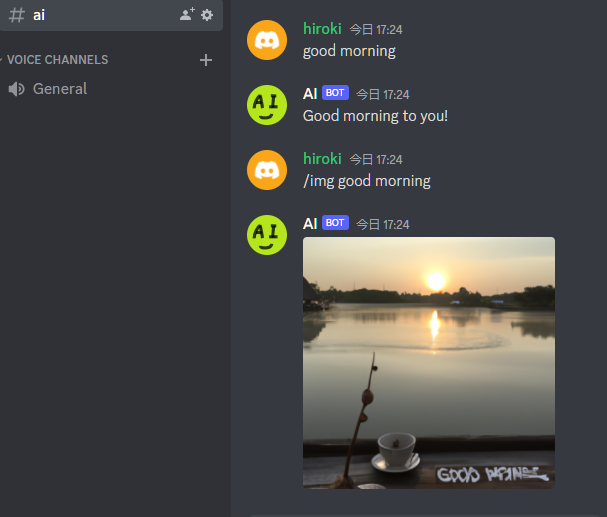

# AI_bot

ChatGPT discord bot

## Discrod Setting(enable Intents)

https://discordpy.readthedocs.io/ja/latest/discord.html

MyApplications -> SETTINGS/Bot -> Privileged Gateway Intents
[PRESENCE INTENT]  
[SERVER MEMBERS INTENT]  
[MESSAGE CONTENT INTENT]  


## Server Setting

replace your-discord-token and your-openai-token

windows

```
SETX /M AI_BOT_TOKEN "your-discord-token"
SETX /M OPENAI_API_KEY "your-openai-token"
python -m pip install -r requirements.txt
python ai_bot.py
```

mac, linux

```
$ export AI_BOT_TOKEN=your-discord-token
$ export OPENAI_API_KEY=your-openai-token
$ sudo python3 -m pip install -r requirements.txt
$ nohup python3 ai_bot.py & 
```

Docker

```
sudo docker build -t bot https://github.com/nagaohiroki/AI_bot.git#main
sudo docker run --env AI_BOT_TOKEN=your-discord-token --env OPENAI_API_KEY=your-openai-token
```

## Message

change discord setting role name to AI -> AI_bot(avoid wrong mention)

```
@AI good morning
@AI /img good morning
```

or on TEXT CHANNELS "ai"

```
good morning
/img good morning
```

 
